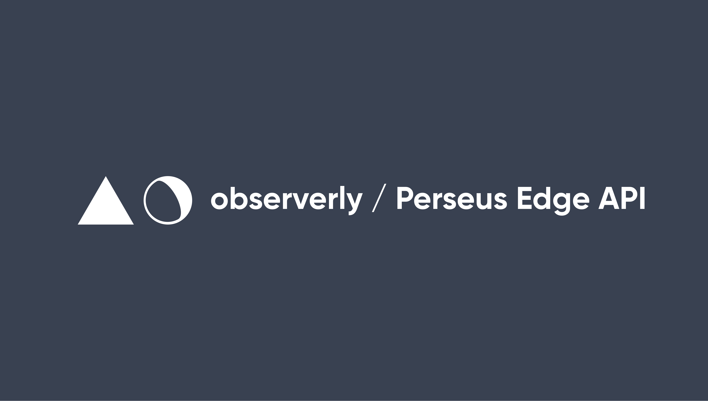

[](https://perseus.observerly.com)

The experimental on-demand, on-the-edge API of stars, galaxies and other astronomical bodies.

---

## Guide

All astronomical bodies in the Perseus API are represented by a **`Body`** object. Each body has a **`type`**.

The types match those from the SIMBAD Astronomical Database [http://simbad.u-strasbg.fr/simbad/](http://simbad.u-strasbg.fr/simbad/).

- \*: Star
- \*\*: Double star
- \*Ass: Association of stars
- OCl: Open Cluster
- GCl: Globular Cluster
- Cl+N: Star cluster + Nebula
- G: Galaxy
- GPair: Galaxy Pair
- GTrpl: Galaxy Triplet
- GGroup: Group of galaxies
- PN: Planetary Nebula
- HII: HII Ionized region
- DrkN: Dark Nebula
- EmN: Emission Nebula
- Neb: Nebula
- RfN: Reflection Nebula
- SNR: Supernova remnant
- Nova: Nova star
- NonEx: Nonexistent object
- Dup: Duplicated object (see NGC or IC columns to find the master object)
- Other: Other classification (see object notes)

Every body, regardless of type, will have an **`ra`**, Right Ascension (quoted in either in J2000 Epoch (HH:MM:SS.SS), hours, or in degrees), and **`dec`**, declincation (quoted in J2000 Epoch (+/-DD:MM:SS.SS) (in degrees) or in degrees).

Every body, regardless of type, will have a **`constellation`**, which is calculated from the **`ra`** and **`dec`**, using a algorithmic lookup technique pioneered by Nancy Roman.

---

## API Development

### Project Requirements

- [Node]() v18.\*.\*
- [pnpm](https://pnpm.io/) 8.\*.\*
- [Nitro](https://nitro.unjs.io/) 2.\*.\*
- [drizzle ORM](https://github.com/drizzle-team/drizzle-orm) 0.25.4
- [LibSQL](https://github.com/libsql/libsql) 0.2.1
- [vitest](https://vitest.dev/) 0.30.1

### Installing Dependencies

The Perseus project manages package dependencies using [pnpm](https://pnpm.io/). You'll need to follow the instructions for installation there.

Before starting development, install all of the dependencies as:

```console
$ pnpm install
```

To add dependencies, simply use the following pnpm command:

```console
$ pnpm add <PACKAGE_NAME>@<PACKAGE_VERSION>
```

**N.B.** _Ensure that any dependency changes are committed to source control, so everyone has a consistenct package dependecy list._

### Local Development

The Perseus (on-the-Edge) development stack is built on Nitro, an open source TypeScript framework to build ultra-fast web servers.

It can be started with the following `pnpm` command.

```console
$ pnpm dev
```

### LibSQL Migrations

The Perseus project utilises the database toolkit drizzle-kit and drizzle-orm, and their database migration tool, and LibSQL. LibSQL is hosted on GitHub at [https://github.com/libsql/libsql](https://github.com/libsql/libsql) under the Chiselstrike/Turso organization.

The most recent published version of the Turso documentation should be at https://docs.turso.tech/.

Make sure you create a "revision" of your models and that you "upgrade" your database with that revision every time you change them. As this is what will update the tables in your database. Otherwise, your application will have errors.

The process for changes to, or additions of, any models associated with this project is as follows:

- If you created a new model in `.server/schema/` or changed a model (for example, adding a column), you can create a journal revision, e.g.:

```console
$ pnpm db:generate -- -m "Added a new column to the Body model"
```

- Make sure to commit to the git repository the files generated in the alembic directory\*.

- After creating the revision, run the migration in the database (this is what will actually change the database schema):

```console
$ pnpm db:push
```

**N.B.** _All drizzle model "revisions" (changes) should be committed to source control, so everyone has a consistent database schema history._

### Seeding API Data

Inside the data folder, there comes a number of files that can be used to seed the database before performing consistent tests.

To run the initial database seeding, you can use the following command:

```console
$ pnpm db:seed
```

This will run the seed scripts in the `scripts` directory, and will seed the database with the data in the `data` directory.

The initial data is a list of major, minor and peripheral stellar bodies as given in the HD-DM-GC-HR-HIP-Bayer-Flamsteed Cross Index (Kostjuk, 2002), which can be found in the VizieR catalogue database here: [VizieR-2](https://vizier.u-strasbg.fr/viz-bin/VizieR-2), and cross-referenced with the IAU list of approved star names (\*as of January 1st, 2021), which can be found here: [https://www.iau.org/public/themes/naming_stars/](https://www.iau.org/public/themes/naming_stars/).

### Flushing API Data

To flush the database, you can use the following command:

```console
$ pnpm db:flush
```

This will run the flush scripts in the `scripts` directory, and will flush the database of all data.

### Running Tests

To run the tests, please ensure you have followed the steps for building the development server.

The Perseus (on-the-Edge) development stack can be installed with the following `pnpm` command:

```console
$ pnpm install
```

You'll need to ensure that you have also generated any migrations needed:

```console
$ pnpm db:generate
```

Then you can push the data to the database with the following command:

```console
$ pnpm db:push
```

Then you can seed the data with the following command:

```console
$ pnpm db:seed
```

You can then run the vitest test suite using the following command:

```
$ pnpm test
```

---

## Acknowledgements

This research has made use of the VizieR catalogue access tool, CDS, Strasbourg, France (DOI : [10.26093/cds/vizier](https://vizier.cds.unistra.fr/)).

The original description of the VizieR service was published in 2000, A&AS 143, 23.

This research has made use of the IAU list of approved star names [https://www.iau.org/public/themes/naming_stars/](https://www.iau.org/public/themes/naming_stars/).
